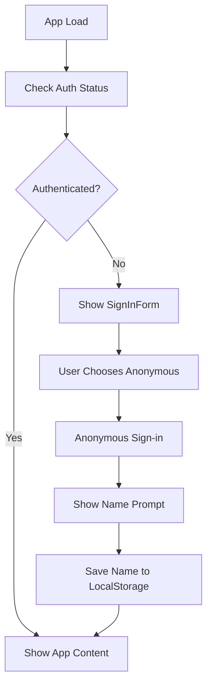
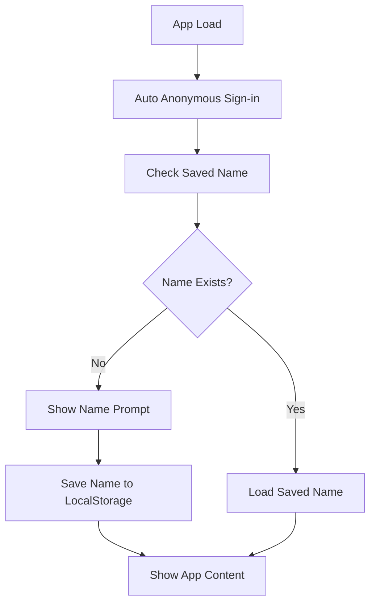
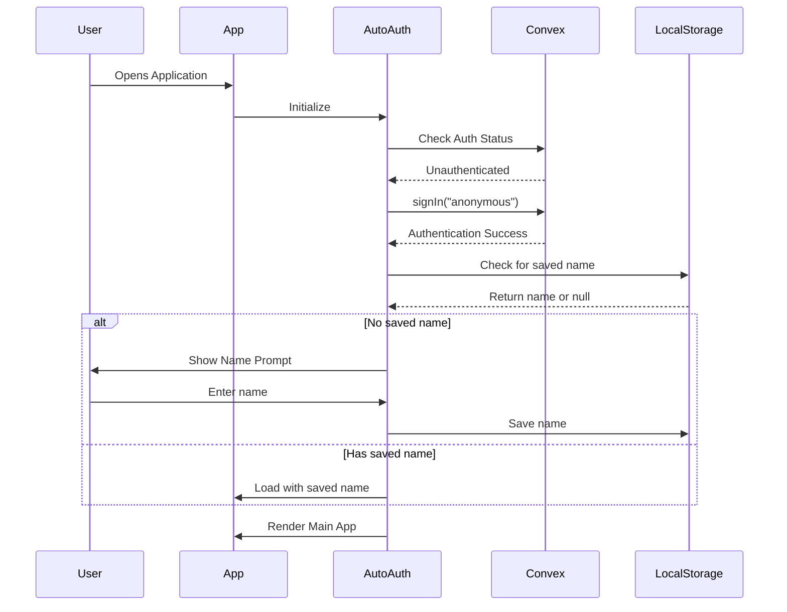

# Anonymous Authentication Design Document

## Overview

This design document outlines the implementation of automatic anonymous authentication for the Dumb Questions Counter app. The goal is to eliminate the manual sign-in process while preserving the user name prompt functionality that enables personalized experiences and user tracking.

**Key Objectives:**
- Remove the explicit sign-in form and manual authentication steps
- Automatically authenticate users anonymously upon app load
- Maintain the "Who are you?" name prompt for user identification
- Preserve all existing functionality (counters, presence, activities)
- Ensure seamless user experience with minimal friction

## Technology Stack & Dependencies

**Frontend:**
- React 19.0.0 with TypeScript
- Convex React SDK for authentication and data management
- Convex Auth with Anonymous provider
- Local Storage for persistent name storage

**Backend:**
- Convex serverless functions
- Convex Auth with Anonymous provider already configured
- Real-time presence and activity tracking

## Architecture

### Current Authentication Flow



### Target Authentication Flow



### Component Architecture

#### Authentication Layer
- **AutoAuthProvider**: New wrapper component that handles automatic anonymous authentication
- **Modified App Component**: Simplified to remove manual authentication handling
- **Removed SignInForm**: No longer needed for anonymous flow

#### User Identity Layer
- **NamePrompt Component**: Standalone component for collecting user names
- **UserNameManager**: Utility for managing name persistence
- **Modified DumbQuestionsApp**: Updated to handle automatic authentication state

## Implementation Strategy

### Phase 1: Authentication Simplification

#### 1.1 Create AutoAuthProvider Component
```typescript
interface AutoAuthProviderProps {
  children: React.ReactNode;
}

// Automatic anonymous authentication wrapper
const AutoAuthProvider: React.FC<AutoAuthProviderProps>
```

**Responsibilities:**
- Detect unauthenticated state on app mount
- Automatically trigger anonymous sign-in
- Handle authentication loading states
- Pass authentication status to children

#### 1.2 Modify App Component Structure
**Current Structure:**
```
App
├── Header
├── Content
    ├── Authenticated → DumbQuestionsApp
    └── Unauthenticated → SignInForm
```

**Target Structure:**
```
App
├── AutoAuthProvider
    ├── Header
    └── AuthenticatedContent
        ├── NamePrompt (conditional)
        └── DumbQuestionsApp (conditional)
```

### Phase 2: User Name Management

#### 2.1 Enhanced Name Prompt Flow
**Current Flow:**
- User manually signs in → Show name prompt → Save to localStorage

**Target Flow:**
- Auto anonymous sign-in → Check localStorage → Show name prompt if needed

#### 2.2 Name Persistence Strategy
```typescript
interface UserNameManager {
  getSavedName(): string | null;
  saveName(name: string): void;
  clearName(): void;
  hasValidName(): boolean;
}
```

### Phase 3: Component Removal and Cleanup

#### 3.1 Remove SignInForm Component
- Delete `src/SignInForm.tsx`
- Remove import references
- Clean up authentication-related styling

#### 3.2 Simplify SignOutButton
- Keep sign-out functionality for user preference
- Update styling to match simplified UI
- Consider repositioning in the interface

## Data Flow Architecture

### Authentication State Management



### User Presence and Activity Flow

**Unchanged from current implementation:**
- Real-time presence updates every 15 seconds
- Activity notifications for counter increments
- Online user tracking and display

## Component Specifications

### AutoAuthProvider Component

**Props:**
```typescript
interface AutoAuthProviderProps {
  children: React.ReactNode;
  fallbackComponent?: React.ComponentType;
}
```

**State Management:**
```typescript
interface AuthState {
  isInitializing: boolean;
  isAuthenticated: boolean;
  userName: string | null;
  showNamePrompt: boolean;
}
```

**Key Methods:**
- `initializeAuth()`: Handle automatic anonymous sign-in
- `handleNameSubmit(name: string)`: Process name submission
- `handleNameChange()`: Allow users to change their name

### Modified DumbQuestionsApp Component

**Changes Required:**
- Remove internal name management logic
- Accept `userName` and `onNameChange` as props
- Simplify initialization logic

**Props Interface:**
```typescript
interface DumbQuestionsAppProps {
  userName: string;
  onNameChange: () => void;
}
```

### Standalone NamePrompt Component

**Props:**
```typescript
interface NamePromptProps {
  onSubmit: (name: string) => void;
  currentName?: string;
  isChanging?: boolean;
}
```

**Features:**
- Focused input on mount
- Form validation
- Loading states during submission
- Clear call-to-action messaging

## Testing Strategy

### Unit Testing

**AutoAuthProvider Tests:**
- Authentication initialization
- Error handling for failed anonymous sign-in
- State transitions during auth flow
- LocalStorage integration

**NamePrompt Component Tests:**
- Form submission validation
- Input handling and state management
- Accessibility compliance
- Error state handling

**Modified App Component Tests:**
- Conditional rendering based on auth state
- Integration with AutoAuthProvider
- User flow from anonymous auth to name prompt to main app

### Integration Testing

**End-to-End User Flows:**
1. **First-time user**: Auto sign-in → Name prompt → Main app
2. **Returning user**: Auto sign-in → Load saved name → Main app
3. **Name change**: Access change name → Update localStorage → Continue
4. **Sign out/in cycle**: Sign out → Auto sign-in → Maintain name

**Real-time Features Testing:**
- Presence updates after anonymous authentication
- Activity notifications between anonymously authenticated users
- Counter synchronization across sessions

### Authentication Testing

**Anonymous Auth Scenarios:**
- Successful automatic authentication
- Network failure during auth
- Multiple tabs/windows with same anonymous user
- Authentication persistence across browser sessions

## Migration Strategy

### Phase 1: Preparation
1. Create AutoAuthProvider component
2. Extract NamePrompt as standalone component
3. Update TypeScript interfaces and prop types

### Phase 2: Integration
1. Wrap App component with AutoAuthProvider
2. Modify App component to use new authentication flow
3. Update DumbQuestionsApp to accept external props

### Phase 3: Cleanup
1. Remove SignInForm component and references
2. Update authentication-related styles
3. Test all user flows and edge cases

### Phase 4: Validation
1. Verify automatic authentication works reliably
2. Confirm name persistence functions correctly
3. Test real-time features with anonymous users
4. Validate accessibility and user experience

## Modern UI Design System

### Design Philosophy
- **Clean & Professional**: Eliminate cartoonish elements, emojis, and playful language
- **Modern Gradients**: Sophisticated color transitions and depth
- **Minimalist Layout**: Focus on content with strategic white space
- **Contemporary Typography**: Professional font hierarchy and spacing
- **Subtle Animations**: Smooth micro-interactions without distraction

### Color Palette & Gradients

#### Primary Gradient System
```css
/* Main App Background */
background: linear-gradient(135deg, #667eea 0%, #764ba2 100%);

/* Card Gradients */
.card-primary: linear-gradient(145deg, #ffffff 0%, #f8fafc 100%);
.card-accent: linear-gradient(145deg, #e0e7ff 0%, #c7d2fe 100%);

/* Button Gradients */
.btn-primary: linear-gradient(135deg, #4f46e5 0%, #7c3aed 100%);
.btn-secondary: linear-gradient(135deg, #6b7280 0%, #4b5563 100%);

/* Status Gradients */
.status-success: linear-gradient(135deg, #10b981 0%, #059669 100%);
.status-warning: linear-gradient(135deg, #f59e0b 0%, #d97706 100%);
```

#### Color Variables
```css
:root {
  --gradient-primary: linear-gradient(135deg, #667eea 0%, #764ba2 100%);
  --gradient-surface: linear-gradient(145deg, #ffffff 0%, #f8fafc 100%);
  --gradient-accent: linear-gradient(145deg, #e0e7ff 0%, #c7d2fe 100%);
  
  --color-text-primary: #1e293b;
  --color-text-secondary: #64748b;
  --color-text-muted: #94a3b8;
  
  --shadow-sm: 0 1px 2px 0 rgb(0 0 0 / 0.05);
  --shadow-md: 0 4px 6px -1px rgb(0 0 0 / 0.1);
  --shadow-lg: 0 10px 15px -3px rgb(0 0 0 / 0.1);
}
```

### Typography System

#### Font Hierarchy
```css
/* Primary Font Stack */
font-family: 'Inter', -apple-system, BlinkMacSystemFont, 'Segoe UI', sans-serif;

/* Heading Styles */
.heading-xl: font-size: 3rem; font-weight: 700; line-height: 1.1;
.heading-lg: font-size: 2.25rem; font-weight: 600; line-height: 1.2;
.heading-md: font-size: 1.5rem; font-weight: 600; line-height: 1.3;
.heading-sm: font-size: 1.25rem; font-weight: 500; line-height: 1.4;

/* Body Text */
.text-lg: font-size: 1.125rem; line-height: 1.5;
.text-base: font-size: 1rem; line-height: 1.6;
.text-sm: font-size: 0.875rem; line-height: 1.5;
```

#### Professional Content Updates
```typescript
// Replace cartoonish content with professional alternatives
const contentUpdates = {
  appTitle: "Question Counter",
  counterButton: "Record Question",
  welcomeMessage: "Welcome back",
  todayLabel: "Questions Today",
  totalLabel: "Total Questions",
  statusOnline: "Active",
  namePrompt: "What should we call you?",
  actionSuccess: "Question recorded successfully"
};
```

### Component Design Specifications

#### Header Component
```css
.header {
  background: rgba(255, 255, 255, 0.9);
  backdrop-filter: blur(10px);
  border-bottom: 1px solid rgba(255, 255, 255, 0.2);
  box-shadow: var(--shadow-sm);
  height: 64px;
}

.header-title {
  font-size: 1.5rem;
  font-weight: 600;
  background: var(--gradient-primary);
  -webkit-background-clip: text;
  -webkit-text-fill-color: transparent;
}
```

#### Counter Cards
```css
.counter-card {
  background: var(--gradient-surface);
  border-radius: 16px;
  padding: 2rem;
  box-shadow: var(--shadow-md);
  border: 1px solid rgba(255, 255, 255, 0.2);
  transition: all 0.3s cubic-bezier(0.4, 0, 0.2, 1);
}

.counter-card:hover {
  transform: translateY(-2px);
  box-shadow: var(--shadow-lg);
}

.counter-value {
  font-size: 3rem;
  font-weight: 700;
  background: var(--gradient-primary);
  -webkit-background-clip: text;
  -webkit-text-fill-color: transparent;
}
```

#### Primary Action Button
```css
.primary-button {
  background: var(--gradient-primary);
  color: white;
  padding: 1rem 2rem;
  border-radius: 12px;
  font-weight: 600;
  font-size: 1.125rem;
  border: none;
  box-shadow: var(--shadow-md);
  transition: all 0.3s cubic-bezier(0.4, 0, 0.2, 1);
}

.primary-button:hover {
  transform: translateY(-1px);
  box-shadow: var(--shadow-lg);
  filter: brightness(1.05);
}

.primary-button:active {
  transform: translateY(0);
}
```

#### Name Prompt Modal
```css
.name-prompt {
  background: var(--gradient-surface);
  border-radius: 20px;
  padding: 2.5rem;
  box-shadow: var(--shadow-lg);
  border: 1px solid rgba(255, 255, 255, 0.2);
  max-width: 400px;
}

.name-input {
  background: rgba(255, 255, 255, 0.8);
  border: 2px solid transparent;
  border-radius: 12px;
  padding: 1rem;
  font-size: 1.125rem;
  transition: all 0.3s ease;
}

.name-input:focus {
  outline: none;
  border-color: #4f46e5;
  box-shadow: 0 0 0 3px rgba(79, 70, 229, 0.1);
}
```

#### Online Users Section
```css
.user-badge {
  background: var(--gradient-accent);
  color: var(--color-text-primary);
  padding: 0.5rem 1rem;
  border-radius: 20px;
  font-size: 0.875rem;
  font-weight: 500;
  display: flex;
  align-items: center;
  gap: 0.5rem;
}

.status-indicator {
  width: 8px;
  height: 8px;
  background: var(--status-success);
  border-radius: 50%;
  animation: pulse 2s infinite;
}

@keyframes pulse {
  0%, 100% { opacity: 1; }
  50% { opacity: 0.5; }
}
```

### Animation & Interaction Design

#### Micro-interactions
```css
/* Smooth transitions for all interactive elements */
* {
  transition: all 0.3s cubic-bezier(0.4, 0, 0.2, 1);
}

/* Loading animations */
.loading-spinner {
  border: 3px solid rgba(79, 70, 229, 0.1);
  border-top: 3px solid #4f46e5;
  border-radius: 50%;
  animation: spin 1s linear infinite;
}

@keyframes spin {
  0% { transform: rotate(0deg); }
  100% { transform: rotate(360deg); }
}

/* Success animation */
.success-animation {
  animation: successPulse 0.6s cubic-bezier(0.4, 0, 0.2, 1);
}

@keyframes successPulse {
  0% { transform: scale(1); }
  50% { transform: scale(1.05); }
  100% { transform: scale(1); }
}
```

#### Page Transitions
```css
.page-transition {
  opacity: 0;
  transform: translateY(20px);
  animation: fadeInUp 0.6s cubic-bezier(0.4, 0, 0.2, 1) forwards;
}

@keyframes fadeInUp {
  to {
    opacity: 1;
    transform: translateY(0);
  }
}
```

### Responsive Design System

#### Breakpoint Strategy
```css
/* Mobile First Approach */
@media (min-width: 640px) { /* sm */ }
@media (min-width: 768px) { /* md */ }
@media (min-width: 1024px) { /* lg */ }
@media (min-width: 1280px) { /* xl */ }
```

#### Mobile Optimizations
```css
@media (max-width: 768px) {
  .counter-card {
    padding: 1.5rem;
    margin-bottom: 1rem;
  }
  
  .primary-button {
    width: 100%;
    padding: 1.25rem;
  }
  
  .name-prompt {
    margin: 1rem;
    padding: 2rem;
  }
}
```

## User Experience Considerations

### Loading States
- Elegant shimmer effects during authentication
- Smooth gradient-based progress indicators
- Professional loading spinners with brand colors
- Seamless transition animations between states

### Accessibility
- High contrast ratios for gradient text overlays
- Proper focus management with visible focus rings
- Screen reader compatible authentication flow
- Keyboard navigation with clear focus indicators
- ARIA labels for gradient-based visual elements

### Error Handling
- Subtle error states with gradient-based indicators
- Professional error messages without emojis
- Graceful fallback if anonymous auth fails
- Clear retry mechanisms with smooth animations

### Performance
- Optimized gradient rendering with CSS transforms
- Efficient animation performance using transform/opacity
- Minimal authentication delay on app load
- Optimized component re-rendering during auth flow
- Lazy loading of non-critical UI elements